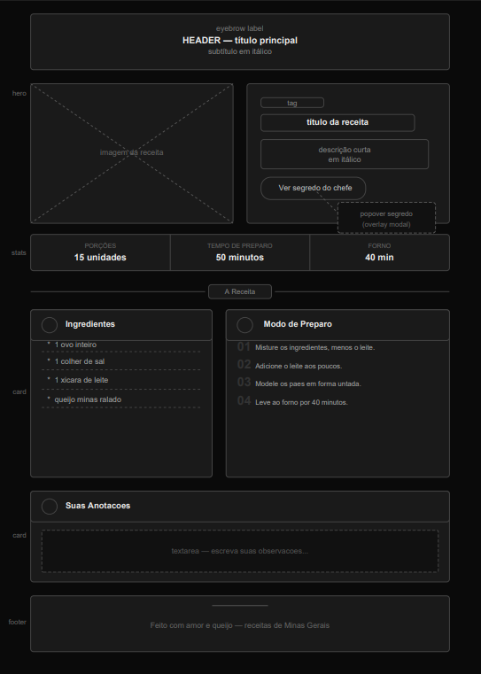

# Wireframe interface ideia.

-Resumo do projeto: Este é um projeto simples e individual desenvolvido com o objetivo de demonstrar habilidades em front-end. Não representa um produto comercial nem faz parte de um sistema maior — é uma página de receita estática construída com HTML e CSS puros, explorando conceitos como layout em grid, tipografia editorial, animações de entrada com @keyframes, a API nativa de popover do HTML, variáveis CSS e responsividade mobile. Feito por uma pessoa, do zero, como portfólio pessoal.
